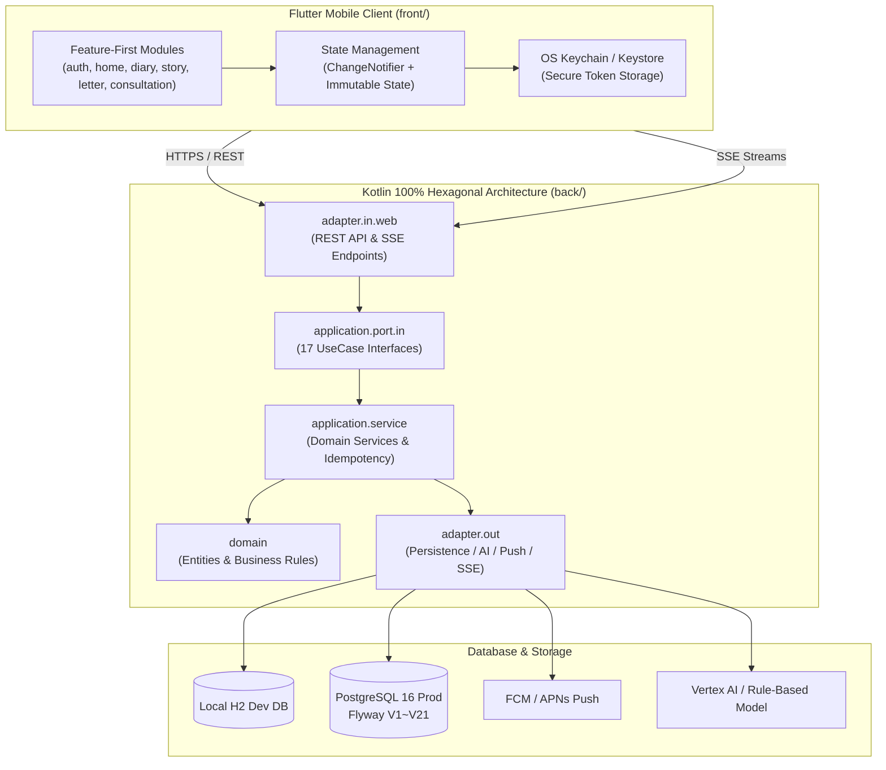

# 📱 마음온 모바일 (Maum On Mobile)

> **"언제 어디서나, 당신의 손끝에서 시작되는 따뜻한 위로와 마음 치유"**
> 마음온 모바일은 일상적인 감정 기록(캘린더 일기), 따뜻한 공감 커뮤니티(스토리), 익명 마음 편지 교환, 24시간 실시간 AI 심리상담 및 위기상담 핫라인 연계를 제공하는 **Android 및 iOS 크로스플랫폼 멘탈케어 모바일 애플리케이션 및 전용 백엔드 서비스**입니다.

<p align="center">
  
  
  
  
  
  
  
  
</p>

---

## 📖 목차

1. [핵심 기능 및 사용자 경험 (Key Features & UX)](#-핵심-기능-및-사용자-경험-key-features--ux)
2. [시스템 아키텍처 (Architecture Overview)](#-시스템-아키텍처-architecture-overview)
3. [워크스페이스 구성 (Workspace Structure)](#-워크스페이스-구성-workspace-structure)
4. [모바일 클라이언트 가이드 (`front/`)](#-모바일-클라이언트-가이드-front)
   - [환경 요구사항 및 SDK 검증](#환경-요구사항-및-sdk-검증)
   - [독립 실행 QA 러너 (Mock Data Mode)](#독립-실행-qa-러너-mock-data-mode)
   - [앱 실행 및 디바이스 타깃](#앱-실행-및-디바이스-타깃)
   - [빌드 및 배포 패키징](#빌드-및-배포-패키징)
5. [백엔드 API 서버 가이드 (`back/`)](#-백엔드-api-서버-가이드-back)
   - [기술 스택 및 아키텍처](#기술-스택-및-아키텍처)
   - [로컬 개발 서버 구동 (H2 Dev Profile)](#로컬-개발-서버-구동-h2-dev-profile)
   - [테스트 및 커버리지 검증](#테스트-및-커버리지-검증)
6. [품질 보증 및 게이트 (Quality Assurance & Gates)](#-품질-보증-및-게이트-quality-assurance--gates)
   - [JSON Schema 계약 테스트](#json-schema-계약-테스트)
   - [10대 모바일 품질 게이트](#10대-모바일-품질-게이트)
   - [릴리스 프리플라이트 진단](#릴리스-프리플라이트-진단)
7. [인프라 및 자동 배포 (CI/CD & Operations)](#-인프라-및-자동-배포-cicd--operations)
8. [거버넌스 및 규칙 (Governance & Hard Rules)](#-거버넌스-및-규칙-governance--hard-rules)

---

## ✨ 핵심 기능 및 사용자 경험 (Key Features & UX)

### 1. 5대 핵심 탭 (Core Tabs)
- 🏠 **홈 (Home)**: 오늘의 감정 요약 카드, 오늘의 공감 사연 큐레이션, 도착한 편지 미리보기, 빠른 액션 단축 버튼.
- 📅 **기록 (Diary)**:
  - 캘린더 기반 날짜별 감정 일기 탐색 및 감정 컬러 도트 인디케이터.
  - 1~5점 감정 점수(`mood_score`) 및 긍정/중립/부정 감정 태그 선택.
  - 웹 호환 안전 텍스트 렌더링, 갤러리 미디어 이미지 첨부, 로컬 작성 중 임시저장 복구.
- 📖 **스토리 (Story)**: 익명 사연 피드 탐색, 사연 작성, 공감(하트) 및 댓글 소통, 불건전 콘텐츠 신고.
- 💌 **편지 (Letter)**: 마음 편지함(수신함 / 발신함), 따뜻한 익명 편지 전송, 송수신 시간 표시, 악성 사용자 차단 및 신고.
- 🧠 **AI 심리상담 (Consultation)**:
  - SSE(Server-Sent Events) 기반 실시간 스트리밍 대화형 AI 상담.
  - 위기/자해 징후 자동 감지 및 즉각적인 **위기상담 핫라인(109, 1577-0199)** 원터치 전화 다이얼 연동.
  - 앱 백그라운드 전환 및 복귀 시 자동 재연결 및 대화 스트림 복원.

### 2. 모바일 특화 UX & 접근성 (Mobile UX & Accessibility)
- 🌓 **라이트 & 다크 테마**: 시스템 설정 자동 감응 및 인앱 수동 토글 지원.
- 🎨 **시그니처 브랜드 톤**: 사용자에게 정서적 안정감을 주는 하늘색 브랜드 컬러 팔레트(`AppBrandColors.primaryBlue`).
- ♿ **접근성(WCAG) 보장**: 모든 터치 인터랙션 최소 48dp 보장, 1.5x 텍스트 스케일링 대응.
- 🔐 **보안 인증 & 소셜 간편 로그인**:
  - 이메일 인증 회원가입, 로그인, 비밀번호 재설정.
  - OIDC / OAuth PKCE 기반 소셜 딥링크 콜백 (`maumon://auth/callback`).
  - OS 보안 키체인/키스토어(`flutter_secure_storage`) 토큰 암호화 저장 및 세션 만료 시 즉시 보호.
- 🔔 **푸시 알림**: FCM / APNs 디바이스 토큰 등록, 백그라운드/콜드스타트 시 특정 탭 자동 라우팅.
- 🛡️ **개인정보 보호**: GDPR/개인정보 내보내기(Export) 및 안전한 회원 탈퇴.
- 🖥️ **관리자 웹 (Flutter Web)**: 신고 내역 검수, 계정 제재, 감사 로그 조회를 지원하는 내부 운영용 웹 콘솔.

---

## 🏛️ 시스템 아키텍처 (Architecture Overview)



---

## 📁 워크스페이스 구성 (Workspace Structure)

```text
maum-on-mobile/
├── front/                     # Flutter 크로스플랫폼 모바일 앱 (Android, iOS, Web Admin)
│   ├── lib/
│   │   ├── features/          # 기능별 클린 아키텍처 (domain, data, application, presentation)
│   │   ├── qa/                # 독립 실행형 QA 러너 (백엔드 목 데이터 내장)
│   │   ├── shared/            # 공통 UI 컴포넌트, 다이얼로그, 테마
│   │   ├── app.dart           # 모바일 앱 루트 위젯 및 탭 네비게이션
│   │   ├── admin_main.dart    # 관리자 웹 진입점
│   │   └── main.dart          # 프로덕션 모바일 진입점
│   ├── android/               # Android 네이티브 설정 (Gradle, 매니페스트)
│   ├── ios/                   # iOS 네이티브 설정 (Xcode 프로젝트, Podfile)
│   └── pubspec.yaml           # Flutter 의존성 정의
├── back/                      # Spring Boot 백엔드 애플리케이션 (Kotlin 100%)
│   ├── src/main/kotlin/com/maumonmobile/
│   │   ├── domain/            # 순수 도메인 엔티티 (diary, story, letter, consultation 등)
│   │   ├── application/       # 유스케이스, 포트, 비즈니스 서비스, 멱등성 보장
│   │   ├── adapter/           # REST 컨트롤러, SSE 레지스트리, JDBC/인메모리 레포지토리
│   │   └── global/            # JWT 보안 필터, 공통 응답, 레이트 리미터, 예외 처리
│   ├── src/main/resources/    # application-{dev, prod, test}.yaml, Flyway V1~V21 마이그레이션
│   └── build.gradle.kts       # Kotlin DSL 빌드 설정
├── contracts/                 # API JSON Schema 계약 및 릴리스 기준 정의
├── tools/                     # 저장소 전용 래퍼 도구 (flutterw)
│   └── ci/                    # 29개 계약 테스트, 품질 게이트, 릴리스 프리플라이트 스크립트
├── docker/                    # 로컬 실행 및 운영 컨테이너 설정
└── infra/                     # OCI 배포 및 클라우드 인프라 설정
```

---

## 📱 모바일 클라이언트 가이드 (`front/`)

### 환경 요구사항 및 SDK 검증
- **Flutter SDK**: 3.44.0 (stable)
- **Dart SDK**: 3.12.0
- **Xcode**: 16.x 이상 (iOS 빌드 시)
- **Android SDK**: API 34+ (Android 빌드 시)
- **CocoaPods & Bundler**: Bundler 2.4.22

저장소 루트의 전용 래퍼(`tools/flutterw`) 및 로컬 점검 도구를 통해 환경을 설정하고 검증합니다:
```bash
# Flutter SDK 버전 확인
tools/flutterw --version

# iOS 의존성 관리자 Bundler 설치 및 CocoaPods 셋업
gem install --user-install bundler -v 2.4.22
cd front/ios && bundle install

# 로컬 종합 점검 (의존성 설치, 정적 분석, 테스트 및 관리자 웹 빌드)
tools/ci/run-local-mobile-checks.sh

# 로컬 개발 환경 상태 진단 (Flutter, Android SDK, Xcode, CocoaPods)
tools/ci/run-local-mobile-checks.sh --doctor
```

### 독립 실행 QA 러너 (Mock Data Mode)
백엔드 API 서버를 띄우지 않고도 프론트엔드의 모든 화면과 인터랙션을 인메모리 가상 데이터로 즉시 테스트할 수 있는 QA 러너를 내장하고 있습니다.

```bash
# 1. 모바일 통합 QA (로그인된 전체 앱 시나리오 테스트)
cd front && ../tools/flutterw run -d <device> -t lib/qa/mobile_qa_app.dart

# 2. 인증 전용 QA (로그인, 회원가입, 비밀번호 재설정 흐름 테스트)
cd front && ../tools/flutterw run -d <device> -t lib/qa/auth_qa_app.dart

# 3. 관리자 웹 QA (크롬 브라우저에서 관리자 대시보드 테스트)
cd front && ../tools/flutterw run -d chrome -t lib/qa/admin_web_qa_app.dart
```

### 앱 실행 및 디바이스 타깃
실제 백엔드 서버와 연동하여 앱을 구동할 경우:

```bash
# Android 에뮬레이터 또는 실기기 실행
tools/flutterw run -d android

# iOS 시뮬레이터 또는 실기기 실행
tools/flutterw run -d ios
```

### 빌드 및 배포 패키징
```bash
# Android Debug APK 빌드
tools/flutterw build apk --debug

# Android Release AppBundle 생성 (배포용 서명 검증 포함)
bash tools/ci/run-android-release-appbundle.sh

# iOS 시뮬레이터 빌드 (코드 사이닝 제외)
tools/flutterw build ios --simulator --no-codesign

# iOS TestFlight Archive 생성
bash tools/ci/run-ios-testflight-archive.sh

# 관리자 웹 프로덕션 빌드
cd front && ../tools/flutterw build web --target lib/admin_main.dart --dart-define=API_BASE_URL=http://localhost:8080
```

---

## ☕ 백엔드 API 서버 가이드 (`back/`)

### 기술 스택 및 아키텍처
- **Language**: **Kotlin 2.2.21** (JVM 21) — *백엔드는 100% Kotlin으로만 작성되며 Java 코드 작성이 엄격히 제한됩니다.*
- **Framework**: Spring Boot 4.0.3, Spring Security, Spring JDBC
- **Database**: H2 (개발용), PostgreSQL 16 (운영용)
- **Migration**: Flyway 11 (`V1__bootstrap.sql` ~ `V21__diary_mood_and_tags.sql`)
- **Architecture**: Hexagonal Architecture (`domain` -> `application` -> `adapter` -> `global`)

### 로컬 개발 서버 구동 (H2 Dev Profile)
로컬 개발 환경에서는 내장 H2 데이터베이스(PostgreSQL 호환 모드)를 사용하여 별도의 DB 설치 없이 원클릭으로 구동할 수 있습니다:

```bash
# H2 dev 프로필로 백엔드 서버 기동
./back/gradlew -p back bootRun --args='--spring.profiles.active=dev'
```
- **서버 기본 포트**: `http://localhost:8080`
- **H2 콘솔 접속**: `http://localhost:8080/h2-console` (JDBC URL: `jdbc:h2:file:./data/maum-on-mobile;MODE=PostgreSQL`)

### 테스트 및 커버리지 검증
```bash
# 전체 테스트 실행 (47개 테스트 클래스 및 Jacoco 커버리지 리포트 생성)
./back/gradlew -p back test

# 특정 컨트롤러 또는 도메인 테스트 실행
./back/gradlew -p back test --tests "com.maumonmobile.adapter.in.web.diary.DiaryControllerTest"

# 아키텍처 패키지 규칙 및 소스 레이아웃 정책 검증
./back/gradlew -p back test --tests "com.maumonmobile.global.SourceLayoutPolicyTest"

# 배포용 JAR 패키징
./back/gradlew -p back build -x test
```

---

## 🛡️ 품질 보증 및 게이트 (Quality Assurance & Gates)

마음온 모바일은 무결한 사용자 경험을 보장하기 위해 다계층 결정론적 검증 게이트를 갖추고 있습니다.

### 1. JSON Schema 계약 테스트
API 응답 스펙의 불변성과 딥링크 라우팅 규격을 즉각 검증합니다:
```bash
node --test tools/ci/*.test.mjs
```

### 2. 10대 모바일 품질 게이트 (`run-mobile-quality-gate.mjs`)
앱의 10대 핵심 사용자 시나리오(인증, 네비게이션, 작성 플로우, 푸시 등록/콜드스타트, 실시간 SSE 생명주기, 다크 테마/접근성, API 레이턴시 예산)를 종합 평가합니다:
```bash
node tools/ci/run-mobile-quality-gate.mjs --platform android --skip-build-artifact
```

### 3. 릴리스 프리플라이트 진단
스토어 배포 전 SDK 버전, 도구 체인 호환성 및 인증서 상태를 최종 사전 점검합니다:
```bash
# Android 릴리스 빌드 도구 체인 사전 점검
bash tools/ci/run-mobile-release-preflight.sh --platform android

# iOS 릴리스 빌드 도구 체인 사전 점검
bash tools/ci/run-mobile-release-preflight.sh --platform ios

# Android 및 iOS 전체 사전 점검
bash tools/ci/run-mobile-release-preflight.sh --platform all
```

---

## 🚀 인프라 및 자동 배포 (CI/CD & Operations)

- **GitHub Actions CI (`ci.yml`)**:
  - Pull Request 및 푸시 발생 시 계약 검증, Kotlin 컴파일/테스트, Flutter 분석/테스트, 9대 릴리스 게이트(보안, 성능, 접근성, 스토어 정책 등)를 병렬 실행합니다.
- **OCI Ampere A1 자동 CD (`deploy-oci-a1.yml`)**:
  - `main` 브랜치 변경 시 Oracle Cloud Infrastructure의 ARM64 (Ampere A1) 서버에 Docker Compose 기반으로 백엔드를 무중단 자동 배포합니다.

---

## 📜 거버넌스 및 규칙 (Governance & Hard Rules)

1. **Single Source of Truth (SSOT)**:
   - 계약(Contracts), 실행 가능한 검증 게이트, 작업 계획서가 시스템의 최우선 정본입니다.
2. **Fail-Closed Principle**:
   - 세션 만료, 인증 실패, 외부 연동 장애 시 조용한 폴백(Silent fallback)이나 임의의 더미 데이터로 가장하지 않고 명확한 에러를 반환합니다.
3. **Pure Kotlin 100%**:
   - 백엔드 코드는 순수 Kotlin으로만 작성하며, `SourceLayoutPolicyTest`를 통해 엄격하게 강제됩니다.
4. **접근성 및 터치 타깃 규약**:
   - 모든 인터랙티브 UI 컴포넌트는 최소 48dp 터치 타깃을 확보해야 하며, 텍스트 확대(1.5x) 시 레이아웃 깨짐이 없어야 합니다.
